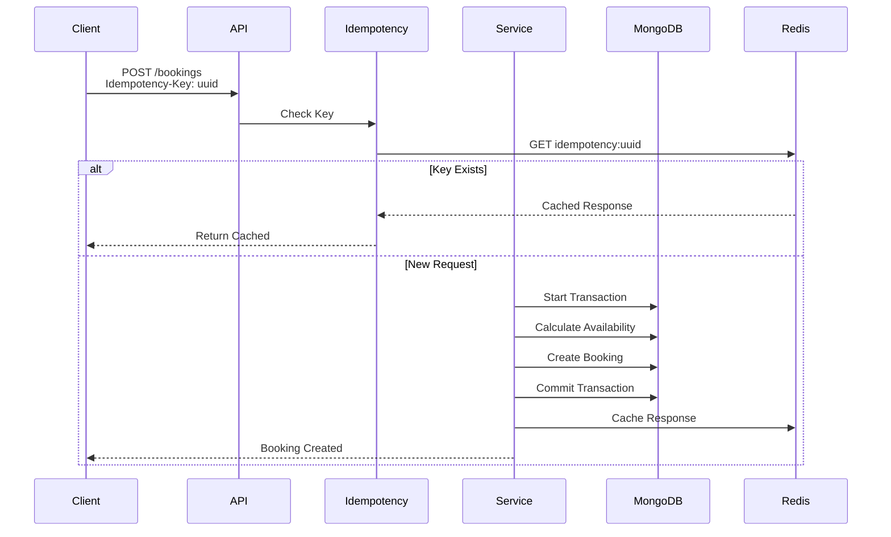

# Architecture Documentation

## System Overview

This is a production-grade ticketing platform backend built with **100% free and open-source technologies**. The system is designed for scalability, performance, security, and real-world production use.

## Key Architectural Decisions

### 1. Calculated Availability (Not Stored)

**Problem**: Storing `availableTickets` as a counter can become inconsistent due to:
- Race conditions
- Failed transactions
- System errors
- Manual database modifications

**Solution**: Calculate availability dynamically:
```typescript
availableTickets = totalTickets - count(confirmedBookings)
```

**Benefits**:
- Always accurate
- No data inconsistency
- Self-healing (corrects itself automatically)

### 2. Atomic Booking Operations

**Problem**: Concurrent requests can cause overbooking.

**Solution**: Hybrid approach:
- **Fast Path**: Atomic `findOneAndUpdate` with availability check
- **Fallback**: MongoDB transactions for complex operations

**Implementation**:
```typescript
// Check availability within transaction
const availability = await calculateAvailability(eventId);
if (availability.availableTickets < quantity) {
  throw ConflictError();
}
// Create booking atomically
await Booking.create({ ... });
```

### 3. Idempotency Keys

**Problem**: Network retries can cause duplicate bookings and charges.

**Solution**: Require `Idempotency-Key` header (UUID) for all booking operations.

**Flow**:
1. Client generates UUID
2. Server checks Redis cache for key
3. If exists: return cached response
4. If new: process request, cache response (24h TTL)

### 4. Redis Caching Strategy

**Use Cases**:
- Event availability (5-10s TTL)
- Idempotency keys (24h TTL)
- Rate limiting counters
- Distributed locking (optional)

**Cache Invalidation**:
- Availability: Invalidated on booking create/cancel
- Event details: Invalidated on event update
- User bookings: Invalidated on booking changes

## Module Structure

### Core Infrastructure

```
core/
├── database/
│   └── mongodb.connection.ts    # MongoDB connection manager (singleton)
├── cache/
│   └── redis.client.ts          # Redis client (singleton)
├── middleware/
│   ├── auth.middleware.ts       # JWT authentication
│   ├── error.middleware.ts      # Centralized error handling
│   ├── validation.middleware.ts # Zod validation
│   ├── rateLimit.middleware.ts  # Rate limiting
│   ├── idempotency.middleware.ts # Idempotency handling
│   └── logger.middleware.ts     # Request logging
├── errors/
│   └── app.error.ts             # Error class hierarchy
├── models/
│   ├── User.model.ts            # User schema
│   ├── Event.model.ts           # Event schema
│   └── Booking.model.ts         # Booking schema
└── utils/
    └── logger.ts                 # Winston logger
```

### Feature Modules

Each module follows a layered architecture:

```
modules/
├── auth/
│   ├── auth.service.ts         # Business logic
│   ├── auth.controller.ts      # HTTP handling
│   └── auth.routes.ts          # Route definitions
├── events/
│   ├── event.service.ts        # CRUD operations
│   ├── event-availability.service.ts # Availability calculation
│   ├── event.controller.ts
│   └── event.routes.ts
└── bookings/
    ├── booking.service.ts      # Concurrency-safe booking
    ├── booking.controller.ts
    └── booking.routes.ts
```

## Database Schema Design

### Event Schema

```typescript
{
  name: string (indexed)
  date: Date (indexed)
  venue: string
  totalTickets: number (stored)
  price: number
  status: enum ['draft', 'published', 'cancelled', 'completed']
  version: number (optimistic locking)
  deletedAt: Date? (soft delete)
}
```

**Indexes**:
- `{ date: 1, status: 1 }` - Date queries with status filter
- `{ status: 1, date: 1 }` - Status-based queries
- `{ name: "text", venue: "text" }` - Text search

### Booking Schema

```typescript
{
  userId: ObjectId (indexed, ref: User)
  eventId: ObjectId (indexed, ref: Event)
  ticketNumber: string (unique)
  status: enum ['pending', 'confirmed', 'cancelled', 'expired']
  idempotencyKey: string (unique, indexed) // CRITICAL
  expiresAt: Date? (for pending bookings)
  cancelledAt: Date?
  deletedAt: Date? (soft delete)
}
```

**Indexes**:
- `{ eventId: 1, status: 1 }` - Availability queries (CRITICAL)
- `{ userId: 1, bookingDate: -1 }` - User bookings
- `{ idempotencyKey: 1 }` - Idempotency check
- `{ userId: 1, eventId: 1, status: 1 }` - Prevent duplicates

## API Design

### Response Format

**Success**:
```json
{
  "success": true,
  "data": {},
  "message": "Operation successful",
  "meta": {} // Pagination metadata
}
```

**Error**:
```json
{
  "success": false,
  "message": "Error message",
  "errors": [
    { "field": "email", "message": "Invalid email" }
  ]
}
```

### Endpoint Structure

All endpoints are versioned: `/api/v1/`

- `GET /health` - Health check
- `POST /api/v1/auth/register` - User registration
- `POST /api/v1/auth/login` - User login
- `POST /api/v1/auth/refresh` - Refresh token
- `GET /api/v1/events` - List events
- `GET /api/v1/events/:id` - Get event details
- `POST /api/v1/bookings` - Book ticket (requires idempotency key)
- `GET /api/v1/bookings` - Get user bookings
- `PATCH /api/v1/bookings/:id/cancel` - Cancel booking

## Security Features

1. **JWT Authentication**: Access tokens (15m) + Refresh tokens (7d)
2. **Password Hashing**: bcrypt with 10 rounds
3. **Rate Limiting**: Per IP/user (100 requests/15min)
4. **Helmet**: Security headers
5. **Input Validation**: Zod schemas
6. **NoSQL Injection Prevention**: Mongoose sanitization
7. **CORS**: Configurable origins

## Performance Optimizations

1. **Connection Pooling**: MongoDB (min: 2, max: 10)
2. **Redis Caching**: Event availability, idempotency keys
3. **Lean Queries**: Mongoose `.lean()` for read operations
4. **Indexes**: Optimized compound indexes
5. **Pagination**: Cursor-based or offset-based
6. **Response Compression**: gzip compression

## Concurrency Handling

### Booking Flow



## Serverless Compatibility

The system is designed for serverless deployment (Vercel, AWS Lambda):

1. **Connection Caching**: MongoDB and Redis connections cached as singletons
2. **Stateless Design**: No in-memory state
3. **Handler Export**: `handler.ts` exports Express app as serverless function
4. **Environment Variables**: All configuration via env vars

## Monitoring & Observability

1. **Structured Logging**: Winston with JSON format
2. **Request Logging**: All requests logged with duration
3. **Error Tracking**: Centralized error handling with stack traces
4. **Health Checks**: `/health` endpoint for monitoring

## Testing Strategy

1. **Unit Tests**: Services and repositories
2. **Integration Tests**: API endpoints
3. **Concurrency Tests**: Simulate 100+ concurrent bookings
4. **Load Tests**: k6 or Artillery for performance testing

## Deployment Options

### 1. Self-Hosted (100% Free)
- MongoDB Community Edition
- Redis (open source)
- VPS (Oracle Cloud Free Tier, AWS Free Tier)

### 2. Cloud Free Tiers
- MongoDB Atlas M0 (512MB)
- Redis Cloud (30MB)
- Vercel Free Tier

### 3. Production Scale
- MongoDB Atlas M10+ ($9+/month)
- Redis Cloud ($10+/month)
- Vercel Pro ($20+/month)

## Future Enhancements

1. **Background Jobs**: BullMQ for booking expiration, emails
2. **Event Sourcing**: Audit trail for all state changes
3. **Read Replicas**: MongoDB read replicas for read-heavy workloads
4. **GraphQL API**: Optional GraphQL layer
5. **Webhooks**: Event notifications for booking changes
6. **Analytics**: Event popularity tracking, booking trends

## License

MIT License - 100% Free and Open Source

