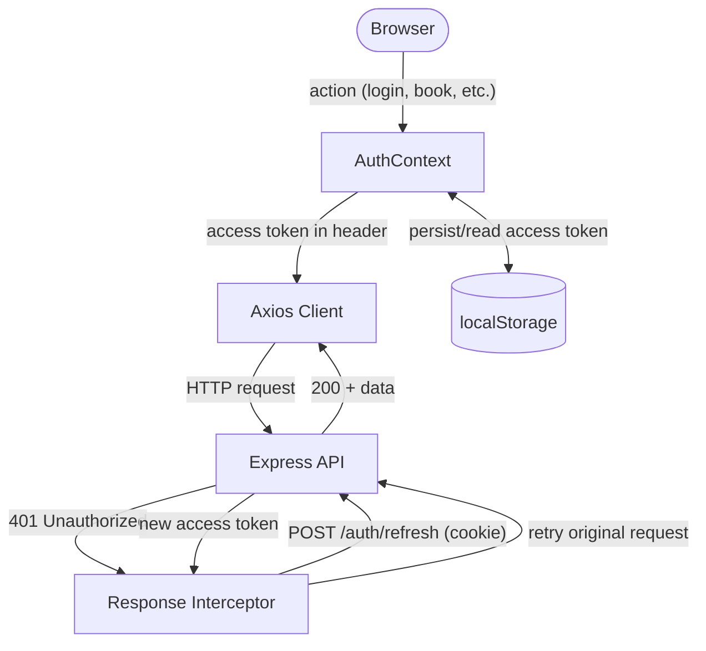
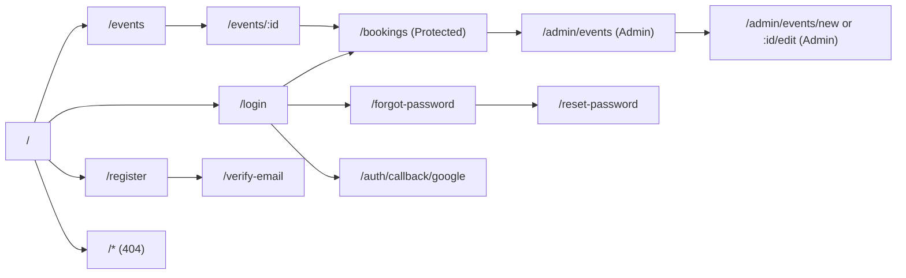

# Ticketing Platform — Frontend Architecture Plan

## Overview

A React 18 + TypeScript single-page application living at `apps/web/` inside the existing monorepo. It consumes all existing backend endpoints, reuses `@ticketing-platform/shared` types and schemas directly, and is styled with Tailwind CSS using a WCAG-AA-compliant semantic color palette. No over-engineering: no Redux, no GraphQL, no extra abstraction layers beyond what the complexity demands.

---

## Backend Contract Summary

Before anything is built, the frontend is locked to these verified backend endpoints and types:

| Domain | Endpoints |
|---|---|
| Auth | `POST /register`, `POST /login`, `POST /refresh`, `POST /logout`, `GET /me`, `POST /verify-email`, `POST /resend-verification`, `POST /forgot-password`, `POST /reset-password`, `POST /google` |
| Events | `GET /events`, `GET /events/:id` (public); `POST`, `PUT`, `DELETE /events/:id` (admin) |
| Bookings | `POST /bookings` (+`Idempotency-Key` header), `GET /bookings`, `GET /bookings/:id`, `PATCH /bookings/:id/cancel` |

All responses follow [`ApiResponse<T>`](packages/shared/src/types/api.types.ts). All types (`Event`, `Booking`, `User`, `AuthResponse`, etc.) come directly from [`@ticketing-platform/shared`](packages/shared/src/index.ts).

---

## Monorepo Integration

`apps/web/` is added as a new workspace. The shared package is referenced as a local dependency — no duplication of types.

```javascript
apps/web/package.json:
  "@ticketing-platform/shared": "*"
```

Turborepo's existing `pipeline.build.dependsOn: ["^build"]` ensures the shared package is always built before `apps/web`.

---

## Folder Structure

```javascript
apps/web/
├── public/
├── src/
│   ├── api/
│   │   ├── client.ts            # Axios instance + request/response interceptors
│   │   ├── auth.api.ts          # All auth endpoint calls
│   │   ├── events.api.ts        # All event endpoint calls
│   │   └── bookings.api.ts      # All booking endpoint calls
│   ├── components/
│   │   ├── ui/                  # Primitive, stateless building blocks
│   │   │   ├── Button.tsx
│   │   │   ├── Input.tsx
│   │   │   ├── Badge.tsx        # Semantic status badge (success/warning/danger)
│   │   │   ├── Spinner.tsx
│   │   │   ├── Modal.tsx
│   │   │   └── Pagination.tsx
│   │   ├── layout/
│   │   │   ├── Header.tsx       # Nav, auth state, logo
│   │   │   ├── Footer.tsx
│   │   │   └── Layout.tsx       # Page wrapper (Header + children + Footer)
│   │   ├── events/
│   │   │   ├── EventCard.tsx           # Grid card with availability badge
│   │   │   ├── EventFilters.tsx        # Search, date, price, status filters
│   │   │   └── AvailabilityBadge.tsx   # Semantic color based on ticket ratio
│   │   ├── bookings/
│   │   │   ├── BookingCard.tsx         # Booking list item with status badge
│   │   │   ├── BookingModal.tsx        # Quantity select + confirm + idempotency
│   │   │   └── CancelModal.tsx         # Cancel reason + confirm
│   │   └── auth/
│   │       ├── ProtectedRoute.tsx      # Redirects to /login if no token
│   │       └── AdminRoute.tsx          # Redirects if role !== admin
│   ├── context/
│   │   └── AuthContext.tsx      # User, accessToken, login, logout, refresh
│   ├── hooks/
│   │   ├── useAuth.ts           # Reads AuthContext
│   │   ├── useEvents.ts         # Fetches event list with filters
│   │   ├── useEvent.ts          # Fetches single event by id
│   │   └── useBookings.ts       # Fetches user's bookings
│   ├── pages/
│   │   ├── HomePage.tsx
│   │   ├── EventsPage.tsx
│   │   ├── EventDetailPage.tsx
│   │   ├── BookingsPage.tsx              # Protected
│   │   ├── auth/
│   │   │   ├── LoginPage.tsx
│   │   │   ├── RegisterPage.tsx
│   │   │   ├── VerifyEmailPage.tsx
│   │   │   ├── ForgotPasswordPage.tsx
│   │   │   ├── ResetPasswordPage.tsx     # Reads ?token= from URL
│   │   │   └── GoogleCallbackPage.tsx    # Reads ?code= then POSTs to /auth/google
│   │   ├── admin/
│   │   │   ├── AdminEventsPage.tsx       # Admin: list + manage events
│   │   │   └── AdminEventFormPage.tsx    # Admin: create / edit event
│   │   └── NotFoundPage.tsx
│   ├── types/
│   │   └── index.ts             # Re-exports everything from @ticketing-platform/shared
│   ├── utils/
│   │   ├── apiError.ts          # Extract readable message from ApiResponse.errors
│   │   ├── formatters.ts        # Date, currency, ticket count formatters
│   │   └── idempotency.ts       # uuid v4 generation for booking requests
│   ├── App.tsx                  # Router setup, lazy imports, Suspense boundaries
│   ├── main.tsx
│   └── index.css                # Tailwind directives
├── .env
├── package.json
├── tailwind.config.ts
├── postcss.config.js
├── vite.config.ts
└── tsconfig.json
```

---

## Data & Auth Flow



---

## Page Routes



---

## Key Technical Decisions

### 1. Token Strategy

- **Access token**: stored in `localStorage` (`accessToken`). Short-lived (15 min).
- **Refresh token**: stored in the `httpOnly` cookie set by the backend — the frontend never reads it directly. Sent automatically on `POST /auth/refresh` via `withCredentials: true`.
- Axios interceptor catches 401, calls `/auth/refresh`, retries once. On retry failure, clears localStorage and redirects to `/login`.

### 2. Axios Client (`api/client.ts`)

Single Axios instance with `baseURL` from `import.meta.env.VITE_API_URL` and `withCredentials: true`. All API files import from this one client — no scattered `axios.create()` calls.

### 3. Idempotency for Bookings

`utils/idempotency.ts` exports a `generateIdempotencyKey()` using `uuid v4`. The `BookingModal` generates one key when it opens and holds it in `useState`. On retry (same modal open), the same key is reused, preventing duplicate bookings.

### 4. Tailwind Color Palette

Extends Tailwind's `colors` in `tailwind.config.ts`. The user-provided hex values map to these semantic tokens:

| Token | Role | When Used |
|---|---|---|
| `primary` | Brand color | CTAs, links, active nav |
| `neutral` (scale) | 60-70% of UI | Backgrounds, cards, text |
| `success` | Green | Available tickets, confirmed bookings |
| `warning` | Amber | Limited availability (< 30% tickets left) |
| `danger` | Red | Sold out, errors, cancellations |
| `info` | Blue | Informational toasts, disabled-but-active states |

Availability thresholds for `AvailabilityBadge`:

- `availableTickets / totalTickets > 0.3` → `success` "Available"
- `0.05 < ratio <= 0.3` → `warning` "Limited"
- `0 < ratio <= 0.05` → `danger` "Almost Sold Out"
- `ratio === 0` → `danger` "Sold Out" (CTA disabled)

### 5. Shared Types — Zero Duplication

`src/types/index.ts` is a single re-export file:

```typescript
export * from '@ticketing-platform/shared';
```

All components, hooks, and API files import from `@/types`, never directly from `axios` or raw strings.

### 6. Lazy Loading & Code Splitting

Every page component is wrapped in `React.lazy`. A single `<Suspense fallback={<Spinner />}>` wraps the `<Routes>` block in `App.tsx`. This means only the visited page's JS bundle is loaded.

### 7. Form Validation

Zod schemas are reused from the shared package via [`@hookform/resolvers/zod`](https://github.com/react-hook-form/resolvers). `createUserSchema`, `loginSchema`, `resetPasswordSchema`, etc. — no re-writing validation logic.

### 8. Admin Panel

A lightweight set of pages behind `<AdminRoute>` (checks `user.role === 'admin'`). Reuses the same `EventCard`, `Input`, `Button` primitives. No separate admin app needed given the scope.

---

## Component Breakdown

### `AuthContext.tsx`

Provides: `user`, `accessToken`, `isAuthenticated`, `isAdmin`, `login(result)`, `logout()`, `setAccessToken()`.

On mount: reads `localStorage.getItem('accessToken')`, silently calls `GET /auth/me` to rehydrate user.

### `api/client.ts`

```typescript
// Pseudocode — not final code, illustrates the structure
const client = axios.create({ baseURL: VITE_API_URL, withCredentials: true });
client.interceptors.request.use(attachBearerToken);
client.interceptors.response.use(identity, handle401WithRefresh);
```

### `BookingModal.tsx`

1. Opens with a `quantity` selector (1–10, constrained by `availableTickets`).
2. Generates UUID once on open via `generateIdempotencyKey()`.
3. On confirm: calls `POST /bookings` with `Idempotency-Key` header.
4. Shows success state with ticket number, or error with retry.

### `GoogleCallbackPage.tsx`

Reads `?code=` from the URL (Google redirects here after consent), calls `POST /api/v1/auth/google`, sets tokens, redirects to `/`.

---

## Environment Variables

`apps/web/.env`:

```env
VITE_API_URL=http://localhost:3000
VITE_GOOGLE_CLIENT_ID=your-google-client-id
```

---

## `package.json` Dependencies

```json
{
  "name": "@ticketing-platform/web",
  "dependencies": {
    "@ticketing-platform/shared": "*",
    "react": "^18.3.1",
    "react-dom": "^18.3.1",
    "react-router-dom": "^6.26.0",
    "axios": "^1.7.0",
    "react-hook-form": "^7.53.0",
    "@hookform/resolvers": "^3.9.0",
    "zod": "^3.23.0",
    "uuid": "^10.0.0"
  },
  "devDependencies": {
    "@types/react": "^18.3.0",
    "@types/react-dom": "^18.3.0",
    "@types/uuid": "^10.0.0",
    "@vitejs/plugin-react": "^4.3.0",
    "tailwindcss": "^3.4.0",
    "postcss": "^8.4.0",
    "autoprefixer": "^10.4.0",
    "typescript": "^5.6.0",
    "vite": "^5.4.0"
  }
}
```

---

## What is NOT included (intentional scope boundaries)

- No payment integration (future milestone)
- No real-time seat maps (out of scope)
- No complex admin dashboard beyond event CRUD
- No SSR / Next.js (Vite SPA is sufficient; no SEO requirement stated)

---

## Implementation Status

All tasks completed ✅

- [x] Scaffold apps/web with Vite, React 18, TypeScript, Tailwind
- [x] Build api/ layer: client.ts with interceptors, auth.api.ts, events.api.ts, bookings.api.ts
- [x] Implement AuthContext + useAuth hook with token storage and silent rehydration
- [x] Build UI primitives: Button, Input, Badge, Spinner, Modal, Pagination
- [x] Build Layout, Header, Footer with nav and auth state
- [x] Build all auth pages: Login, Register, VerifyEmail, ForgotPassword, ResetPassword, GoogleCallback
- [x] Build Events pages: HomePage, EventsPage, EventDetailPage with filters, availability badge, and booking modal
- [x] Build BookingsPage with booking cards and cancel flow
- [x] Build Admin pages: AdminEventsPage and AdminEventFormPage
- [x] Wire App.tsx with lazy routes, Suspense, ProtectedRoute, AdminRoute

